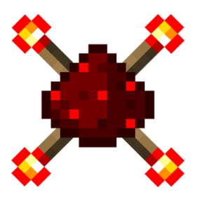

# Projet_minecraft
## Voici notre projet tutoré de DUT informatique réalisé au cours de notre 2ème année dans le but d'apprendre la logique booléenne

<h2>Voici les instructions d'installation de la map et les mods requis</h2>
<a href="https://github.com/Tutur62/Projet_minecraft/wiki">Pour plus d'information, veuillez visiter notre wiki...</a>
<ul>
  <li>Tout les mods sont à télécharger en 1.10.2</li>
  <li>Lancer minecraft et installer la version 1.10.2</li>
  <li>Installer <a href="https://files.minecraftforge.net/">forge</a></li>
  <li>Windows+R -> %appdata% -> .minecraft -> mods(si il n'exite pas ,créez le)
  <li>Mettre les .jar récupéres de<a href="https://www.minecraft-france.fr/mod-project-red-redstone-1-7-10/"> Project Red</a> et <a href="http://www.minecraftforum.net/forums/mapping-and-modding-java-edition/minecraft-mods/1274287-eloraams-mods-redpower-2-prerelease-6"> Red Power</a> dans le dossier mods</li>
  <li><a href="https://codeload.github.com/Tutur62/Projet_minecraft/zip/master">Télécharger la version actuelle de la map</a></li>
  <li><a href="https://goo.gl/forms/LcvfU5NFHxtiN2RY2">N'oubliez pas de donner votre Feedback</a></li>
